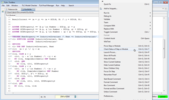
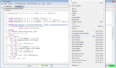
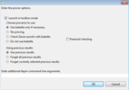

## Advanced options

### Status checking

The Toolbox remembers the coloring of proof steps. It can be very useful
when re-opening a module to know quicky what has been already proved and
what has not. However, the color used by the Toolbox to highlight a
proof step reflects the step's proof status the last time TLAPS checked
the proof. This status may be obsolete if you have edited the proof
since then. You can check the current status of a proof step (and of all
its substeps) by clicking and then right-clicking on the step (or use
the `ctrl+G,ctrl+T / cmd-G,cmd-T` shortcut), as shown in the
following screenshot:

|                                                            |
|------------------------------------------------------------|
|  |

Proving an obligation can take time, but checking its status is pretty
fast. (It is not instantaneous because the obligations still have to be
computed.) It's a good idea to check the proof status of the complete
theorem from time to time, since changing some step could change a later
proof obligation, making its previous status no longer meaningful. You
can edit your file while the Toolbox is checking proof statuses. (The
file is read-only while a proof is in progress.) You can instruct TLAPS
to check the status of (or to prove) all theorems in the file by giving
the usual command when the cursor is outside any theorem or its proof.

### Prover options

If you don't use [tactics](tactics.html), the default behaviour of TLAPS
is to send obligations to Z3, then to Zenon, then to Isabelle, stopping
when one of them succeeds. You can change this behavior, by clicking on
"Launch Prover" when right-clicking on a proof-step:

|                                                            |
|------------------------------------------------------------|
|  |

As you can see, you can either ask TLAPS not to prove obligations
(that's similar to status checking), or ask TLAPS to make Isabelle check
proofs provided by Zenon.

|                                                            |
|------------------------------------------------------------|
|  |

You can also ask TLAPS to forget previous results about obligations of a
particular proof-step or the entire module.

Finally, you can specify command-line options that will be added to the
ones normally used by the Toolbox when it launches `tlapm`. The most
useful options are the following:

- `--threads` *n* : change the maximum number of back-end provers that are
  launched in parallel. The default is the number of CPU cores on your machine.
- `--method` *list* : change the default list of back-end provers for
  `BY` and `OBVIOUS` steps. The argument is a comma-separated list of
  methods. The following methods are available:

  | name  | method                              |
  |-------|-------------------------------------|
  | zenon | Zenon                               |
  | auto  | Isabelle with tactic `auto`         |
  | blast | Isabelle with tactic `blast`        |
  | force | Isabelle with tactic `force`        |
  | smt   | baseline SMT solver (by default Z3) |
  | z3    | Z3                                  |
  | cvc4  | CVC4                                |

- `--solver` *line* : change the baseline SMT solver. See
  [Tactics](tactics.html#solvers) for instructions on using this option.
-   `--fast-isabelle` : on Windows, invoke Isabelle via a short-cut that
  saves a few seconds from Isabelle's start-up time. On other
  architectures, this option does nothing.
- `--stretch` *f* : multiply all timeouts by a factor of *f*. This is
  particularly useful when using a slower machine to re-check proofs
  made on a faster machine.

The internal processing that the program `tlapm` performs is shown in
the following diagram. `tlapm` reads a TLA+ file (or TLA+ files), parses
it, applies a number of transformations, and at some point converts to
formats that can be used to communicate with external solvers (these are
other programs). These solvers include:

- an SMT solver (
  [`z3`](https://en.wikipedia.org/wiki/Z3_Theorem_Prover),
  [`cvc4`](https://cvc4.github.io),
  [`veriT`](https://www.verit-solver.org), or other),
- the automated theorem prover [`zenon`](http://zenon-prover.org),
- the proof assistant Isabelle with the [formalization of TLA+](
      https://members.loria.fr/SMerz/projects/tlaps/index.html)
  ([Isabelle files](
      https://github.com/tlaplus/tlapm/tree/master/isabelle)),
- and the propositional temporal logic prover
  [`ls4`](https://github.com/quickbeam123/ls4) via the interface program
  [`ptl_to_trp`](https://cgi.csc.liv.ac.uk/~konev/software/trp++/translator/).

Depending on what these external solvers return to `tlapm`, `tlapm`
outputs to the [TLA+ Toolbox](
    https://lamport.azurewebsites.net/tla/toolbox.html),
and to [stdout](
    https://en.wikipedia.org/wiki/Standard_streams#Standard_output_(stdout))
and [stderr](
    https://en.wikipedia.org/wiki/Standard_streams#Standard_error_(stderr)),
which parts of the proof `tlapm` could successfully prove, and which
parts not. This output indicates which parts of the proof need further
changes, e.g., by adding more details to the proof, or by changing what
we are attempting to prove.

The internal transformations within `tlapm` include:

- the generation of proof obligations, which can be thought of as
  individual "theorems" that `tlapm` needs to prove in order to prove
  the entire module (not to be confused with `THEOREM` statements in
  the TLA+ source file),
- the normalization of expressions and expansion of defined operators
  by their [definiens](https://en.wiktionary.org/wiki/definiens),
- the interpretation of the operators `ENABLED` and `\cdot`,
- the computation (and later saving) of fingerprints of proof
  obligations (to remember proof results and skip reproving them in
  later invocations of `tlapm`), and
- [coalescing](https://arxiv.org/abs/1409.3819).

For each proof step, more than one proof obligation may be generated.
Among the proof obligations that are generated from a proof step, there
is one proof obligation that has as consequent the same consequent as
that proof step in the TLA+ source. The other proof obligations that are
generated from that same proof step have as consequents the facts that
are listed in the `BY` statement of that proof step (i.e., the
identifiers and expressions listed within the `BY` statement *before*
the keyword `DEF`).

