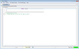

## Preamble
<div class="hr"></div>

TLAPS is a proof system for checking TLA+ proofs. See the [TLA Home page](
    http://research.microsoft.com/en-us/um/people/lamport/tla/tla.html)
to learn about the TLA+ specification language. The proof language is a
new addition to TLA+; it is described [here](
    http://research.microsoft.com/en-us/um/people/lamport/tla/tla2.html).
However, this is a reference manual; you should try some examples before
reading it.

This tutorial consists of a simple example. If you have no experience
with TLA+ or using theorem provers, you might start instead with the
[TLA+ Hyperbook](
    http://research.microsoft.com/en-us/um/people/lamport/tla/hyperbook.html)
or the [TLA+ Video Course](
    http://lamport.azurewebsites.net/video/videos.html). This
tutorial will introduce concepts of the [TLA+ proof language](
    http://research.microsoft.com/en-us/um/people/lamport/tla/tla2.html)
as needed.

The proof system is designed to be used with the [ToolBox](
    http://research.microsoft.com/en-us/um/people/lamport/tla/toolbox.html)
IDE. In this tutorial, we assume that you are using that IDE (even if we
sometimes indicate how proofs can be run from the command line).


## The example
<div class="hr"></div>

Broadly speaking, a TLA+ proof is a collection of *claims*, arranged in
a hierarchical structure which we describe below, where each claim has
an *assertion* that is either *unjustified* or justified by a collection
of *cited facts*. The purpose of TLAPS is to check the user-provided
proofs of theorems, that is, to check that the hierarchy of claims
indeed establishes the truth of the theorem if the claims were true, and
then to check that the assertion of every justified claim indeed is
implied *by* its cited facts. If a TLA+ theorem has a proof with no
unjustified claims, then, as a result of checking the proof, TLAPS
verifies the truth of the theorem.

We shall illustrate the TLAPS by proving the correctness of the
[Euclidean algorithm](
    http://en.wikipedia.org/wiki/Euclidean_algorithm).


### The algorithm
<div class="hr"></div>

The well-known Euclidean algorithm can be written in the
[PlusCal](
    https://lamport.azurewebsites.net/tla/p-manual.pdf)
language as follows:

```tla
--algorithm Euclid {
  variables x \in 1..M, y \in 1..N, x0 = x, y0 = y;
  {
    while (x # y) {
      if (x &lt; y) { y := y - x; }
      else { x := x-y; }
    };
    assert x = GCD(x0, y0) /\ y = GCD(x0, y0)
  }
}
```

The PlusCal translator translates this algorithm into a TLA+
specification that we could prove correct. However, in this tutorial, we
shall write a somewhat simpler specification of Euclid's algorithm
directly in TLA+.


### Creating a new TLA+ module
<div class="hr"></div>

First of all, let us create a new specification within the ToolBox
(click on the thumbnails to expand the screenshots).

<div class="bg">

|    |    |     |
|----|----|-----|
| [](screenshots/addnewspec.png) | [](screenshots/name.png) | [](screenshots/result.png) |

</div>


### Importing modules
<div class="hr"></div>

In order to get the definitions of arithmetic operators (+, -, *etc.*),
we shall make this specification *extend* the Integers standard module.

```tla
-------------------- MODULE Euclid --------------------
EXTENDS Integers

=======================================================
```


### Definitions
<div class="hr"></div>

We shall then define the GCD of two integers. For that purpose, let us
define the predicate "p divides q" as follows:
p divides q iff there exists some integer d in the interval 1..q such
that q is equal to p times d.

```tla
p | q == \E d \in 1..q : q = p * d
```

We then define the set of divisors of an integer q as the sets of
integers which both belong to the interval 1..q and divide q:

```tla
Divisors(q) == {d \in 1..q : d | q}
```

We define the maximum of a set S as one of the elements of this set
which is greater than or equal to all the other elements:

```tla
Maximum(S) == CHOOSE x \in S : \A y \in S : x >= y
```

And finally, we define the GCD of two integers p and q to be the maximum
of the intersection of Divisors(p) and Divisors(q):

```tla
GCD(p,q) == Maximum(Divisors(p) \cap Divisors(q))
```

For convenience, we shall also define the set of all positive integers
as:

```tla
Number == Nat \ {0}
```

When we save the specification (with the menu File > Save), the
toolbox launches the SANY syntactic analyzer and reports any errors that
might appear.


### Constants and variables
<div class="hr"></div>

We then define the two constants and two variables needed to describe
the Euclidean algorithm, where M and N are the values whose GCD is to be
computed:

```tla
CONSTANTS M, N
VARIABLES x, y
```


### The specification
<div class="hr"></div>

We define the initial state of the Euclidean algorithm as follows:

```tla
Init == (x = M) /\ (y = N)
```

In the Euclidean algorithm, two actions can be performed:

- set the value of `y` to `y - x` if `x < y`
- set the value of `x` to `x - y` if `x > y`.

These actions are again written as a definition called Next, which
specifies the next-state relation. In TLA+, a primed variable refers to
its value at the next state of the algorithm.

```tla
Next == \/ /\ x < y
           /\ y' = y - x
           /\ x' = x
        \/ /\ y < x
           /\ x' = x-y
           /\ y' = y
```

The specification of the algorithm asserts that the variables have the
correct initial values and, in each execution step, either a Next action
is performed or x and y keep the same values:

```tla
Spec == Init /\ [][Next]_<<x,y>>
```

(For reasons that are irrelevant to this algorithm, TLA specifications
always allow *stuttering steps* that leave all the variables unchanged.)

We want to prove that the algorithm always satisfies the following
property:

```tla
ResultCorrect == (x = y) => x = GCD(M, N)
```

Hence we want to prove the following theorem named Correctness:

```tla
THEOREM Correctness == Spec => []ResultCorrect
```


### Summary
<div class="hr"></div>

```tla
-------------------- MODULE Euclid --------------------
EXTENDS Integers

p | q == \E d \in 1..q : q = p * d
Divisors(q) == {d \in 1..q : d | q}
Maximum(S) == CHOOSE x \in S : \A y \in S : x >= y
GCD(p,q) == Maximum(Divisors(p) \cap Divisors(q))
Number == Nat \ {0}

CONSTANTS M, N
VARIABLES x, y

Init == (x = M) /\ (y = N)

Next == \/ /\ x < y
           /\ y' = y - x
           /\ x' = x
        \/ /\ y < x
           /\ x' = x-y
           /\ y' = y

Spec == Init /\ [][Next]_<<x,y>>

ResultCorrect == (x = y) => x = GCD(M, N)

THEOREM Correctness == Spec => []ResultCorrect

=======================================================
```
