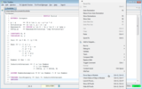
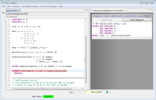
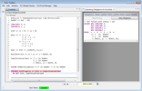
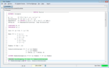

## A simple proof
<div class="hr"></div>


### The invariant
<div class="hr"></div>

Intuitively, the theorem Correctness holds because the implementation
guarantees the following *invariant*

```tla
InductiveInvariant == /\ x \in Number
                      /\ y \in Number
                      /\ GCD(x, y) = GCD(M, N)
```

That is, `InductiveInvariant` holds for the initial state (*i.e.*, the
state specified by `Init`) and is preserved by the next-state relation
`[Next]_<<x, y>>`.


### Checking proofs
<div class="hr"></div>

First we need to assume that constants `M` and `N` are not equal to zero.

```tla
ASSUME NumberAssumption == M \in Number /\ N \in Number
```

Let us then prove that `InductiveInvariant` holds for the initial state.

```tla
THEOREM InitProperty == Init => InductiveInvariant
```

To check wether TLAPS can prove that theorem by itself, we declare its
proof obvious.

```tla
THEOREM InitProperty == Init => InductiveInvariant
  OBVIOUS
```

We can now ask TLAPS to prove that theorem, by right-clicking on the
line of the theorem (or use the `ctrl+G,ctrl+G / cmd-G,cmd-G` shortcut),
as shown in the following screenshot:

<div class="bg">

|                                                                  |
|------------------------------------------------------------------|
| [](screenshots/prove1.png) |

</div>

But TLAPS does not know how to prove the proof obligation corresponding
to that proof. As you can see in the following screenshot, it prints
that obligation and reports failures of three backends, Zenon, Isabelle,
and SMT. The default behavior of TLAPS is to send obligations first to
an SMT solver (by default Z3), then if that fails to the automatic
prover Zenon, then if Zenon fails to Isabelle (with the tactic "auto").
See the [tactics section](tactics.html) to learn more about this
process.

<div class="bg">

|                                                                  |
|------------------------------------------------------------------|
| [](screenshots/prove2.png) |

</div>


### Using facts and definitions
<div class="hr"></div>

As you can see, the obligation cannot be proved because TLAPS treats the
symbols `Init` and `InductiveInvariant` as opaque identifiers unless it is
explicitly instructed to expand their definitions using the directive
`DEF`. The main purpose of this treatment of definitions is to make
proof-checking tractable, because expanding definitions can arbitrarily
increase the size of expressions. Explicit use of definitions is also a
good hint to the (human) reader to look only at the listed definitions
to understand a proof step. In that precise case, we can ask TLAPS to
expand definitions of `Init` and `InductiveInvariant`, by replacing the
proof `OBVIOUS` by the proof `BY DEF Init, InductiveInvariant`. You can see
that, in the obligation sent to the backends, the definitions of `Init`
and `InductiveInvariant` have been expanded:

<div class="bg">

|                                                                  |
|------------------------------------------------------------------|
| [](screenshots/prove3.png) |

</div>

Unfortunately, the theorem is still colored red, meaning that none of
the back-ends could prove that obligation. As with definitions, we have
to specify which facts are *usable*. In this case, we have to make the
fact NumberAssumption usable by changing the proof to:

```tla
THEOREM InitProperty == Init => InductiveInvariant
  BY NumberAssumption DEF Init, InductiveInvariant
```

The general form of a BY proof is:

```tla
BY e_1, …, e_m DEF d_1, …, d_n
```

which claims that the assertion follows by assuming `e_1`, …, `e_m` and
expanding the definitions `d_1`, …, `d_n`. It is the job of TLAPS to
then check this claim, and also to check that the cited facts
`e_1`, …, `e_m` are indeed true.

Finally, SMT succeeds in proving that obligation and the theorem gets
colored green:

<div class="bg">

|                                                                  |
|------------------------------------------------------------------|
| [](screenshots/prove4.png) |

</div>


### Summary
<div class="hr"></div>

```tla
-------------------- MODULE Euclid --------------------
EXTENDS Integers

p | q == \E d \in 1..q : q = p * d
Divisors(q) == {d \in 1..q : d | q}
Maximum(S) == CHOOSE x \in S : \A y \in S : x >= y
GCD(p,q) == Maximum(Divisors(p) \cap Divisors(q))
Number == Nat \ {0}

CONSTANTS M, N
VARIABLES x, y

Init == (x = M) /\ (y = N)

Next == \/ /\ x < y
           /\ y' = y - x
           /\ x' = x
        \/ /\ y < x
           /\ x' = x-y
           /\ y' = y

Spec == Init /\ [][Next]_<<x,y>>

ResultCorrect == (x = y) => x = GCD(M, N)

InductiveInvariant == /\ x \in Number
                      /\ y \in Number
                      /\ GCD(x, y) = GCD(M, N)

ASSUME NumberAssumption == M \in Number /\ N \in Number

THEOREM InitProperty == Init => InductiveInvariant
  BY NumberAssumption DEF Init, InductiveInvariant

THEOREM Correctness == Spec => []ResultCorrect

=======================================================
```
