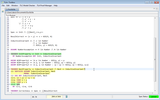
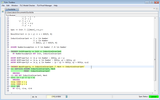
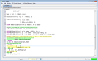
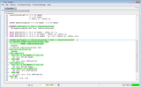
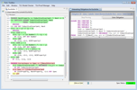
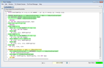

<!DOCTYPE html PUBLIC "-//W3C//DTD XHTML 1.0 Transitional//EN" "http://www.w3.org/TR/xhtml1/DTD/xhtml1-transitional.dtd">
<html xmlns="http://www.w3.org/1999/xhtml" xml:lang="en-US" lang="en-US">
<head>
<meta http-equiv="Content-Type" content="text/html; charset=utf-8" />
<link rel="stylesheet" type="text/css" id="ss"/>
<title>TLA+ Proof System</title>
</head>
<body>
<script type="text/javascript">
  var baseurl = (document.URL.match (/.*[\\\/]content[\\\/]/))[0]
  baseurl = baseurl.slice (0, baseurl.length - "content/".length)
  document.getElementById('ss').href = baseurl + 'assets/css/common.css'
  document.write ('\x3Cscript type="text/javascript" src="'
                  + baseurl + 'assets/header.js">\x3C/script>')
</script>

<!-- DO NOT EDIT ABOVE THIS LINE, DO NOT REMOVE THIS LINE -->


## Hierarchical proofs
<div class="hr"></div>

Our proof requires the following properties of GCDs, which for
simplicity we just assume:

```tla
AXIOM GCDProperty1 == \A p \in Number : GCD(p, p) = p
AXIOM GCDProperty2 == \A p, q \in Number : GCD(p, q) = GCD(q, p)
AXIOM GCDProperty3 == \A p, q \in Number : (p < q) => GCD(p, q) = GCD(p, q-p)
```


### Known and usable facts
<div class="hr"></div>

At any point in a TLA+ proof, there is a current obligation that is to
be proved. The obligation contains a *context* of *known* facts,
definitions, and declarations, and a *goal*. The obligation claims
that the goal is logically entailed by the context.
Some of the facts and definitions in the context are marked as *usable*
for reasoning, while the remaining facts and definitions are *hidden*.
That obligation is then sent to a backend (
[Zenon](
    http://zenon-prover.org),
[Isabelle](
    http://www.cl.cam.ac.uk/research/hvg/Isabelle/), SMT solvers
– see the [tactics section](tactics.html)) that tries to prove it. The
smaller the context is, the faster those backends are. Hence TLAPS tries
to keep that context as small as possible. For example, the axioms about
GCD stated above are not directly usable by the backends: they are *known*
but *not usable*. As we have seen in the
[simple proof section](a_simple_proof.html), you have to explicitly USE
or *cite* a fact in order for it to be included in the context of the
obligation sent to backends. As an exception to this rule, *domain facts*
of the form `x \in S` are always usable in a proof. (Such
assumptions are typically introduced in an `ASSUME` … `PROVE` construct,
most frequently in the form of an assumption `NEW x \in X`.) Moreover,
*unnamed* proof steps (see below) are aways usable.
The other known facts are hidden by default.

Let us get back to our example. Now that we have proved that the initial
state satisfies the invariant, let us prove that this invariant is
preserved by the next-state relation `Next`

```tla
THEOREM NextProperty == InductiveInvariant /\ Next => InductiveInvariant'
```


### SUFFICES
<div class="hr"></div>

Let us first simplify the goal to be proved by using a `SUFFICES` construct:

```tla
THEOREM NextProperty == InductiveInvariant /\ Next => InductiveInvariant'
<1> SUFFICES ASSUME InductiveInvariant, Next
             PROVE  InductiveInvariant'
```

This step asserts that it is sufficient to prove `InductiveInvariant'`
while assuming `InductiveInvariant` and `Next`. Because the step is unnamed,
both facts `InductiveInvariant` and `Next` are also made usable for the
remainder of the proof. For more information about `SUFFICES`, see the
section about [other proof constructs](other_proof_constructs.html).


### USE
<div class="hr"></div>

We'll need the definitions of `InductiveInvariant` and `Next` to be usable
in the entire body of the proof. Hence, rather than making them usable
with a `BY DEF` construct in each step, we can make them usable for all
proof steps by using the `USE DEF` construct once, at the beginning of
the proof:

```tla
THEOREM NextProperty == InductiveInvariant /\ Next => InductiveInvariant'
<1> SUFFICES ASSUME InductiveInvariant, Next
             PROVE  InductiveInvariant'
<1> USE DEF InductiveInvariant, Next
```

The general form of a `USE` step is:

```tla
USE e_1, …, e_m DEF d_1, …, d_n
```

which asserts that the definitions `d_1`, … `d_n` are to be made usable, and
the facts `e_1`, …, `e_m` are to be checked and then added to the context
as usable. When checking these facts, all other known facts are temporarily
considered to be usable, so it is possible to say `USE e /\ f` when
`e` and `f` are in the context but hidden. Observe that the `USE` directive
is syntactically similar to `BY`, but it obviously does not check if
the current assertion follows from the cited facts.


### The QED step
<div class="hr"></div>

To prove the theorem `NextProperty`, we have to reason by cases, and prove
that `InductiveInvariant'` is true when one of the actions of `Next` is
performed (i.e. when `x < y` and also when `x > y`). Let us write this
outer level of the hierarchical proof:

```tla
THEOREM NextProperty == InductiveInvariant /\ Next => InductiveInvariant'
<1> SUFFICES ASSUME InductiveInvariant, Next
             PROVE  InductiveInvariant'
<1> USE DEF InductiveInvariant, Next
<1>1 (x < y) \/ (y < x)
<1>a CASE x < y
<1>b CASE y < x
<1>2 QED
  BY <1>1, <1>a, <1>b
```

`<1>1`, `<1>a`, `<1>b` and `<1>2` are *step names* (the `<1>` part of
the step name indicates the step's *level*, which is 1.
The proof itself consists of four claims named by these step names
(plus the two first unnamed steps); the first three are unjustified,
while the last is justified by the cited facts `<1>1`, `<1>a` and `<1>b`.
The `QED` step asserts the main goal of the theorem.
Let us verify that it can be proved from steps `<1>1`, `<1>a` and `<1>b`:

<div class="bg">

|                                                            |
|------------------------------------------------------------|
| [](screenshots/qed.png) |

</div>

After having asked TLAPS to prove the theorem, the QED step gets colored
green. This means that facts mentioned by steps `<1>1`, `<1>a` and `<1>b`
are sufficient to prove the theorem. But as you can see,
those proof steps are colored yellow, which means that their proofs are
omitted. (The Toolbox allows you to change what colors are used to
indicate the proof status of a step, and also what proof statuses are
displayed.) Let us now prove these proof steps.


### Non-QED steps
<div class="hr"></div>

First, the proofs of the `SUFFICES` step and step `<1>1` are obvious
as you can see in the following screenshot. In particular, step
`<1>1` follows from the usable fact `Next` introduced in the unnamed
`SUFFICES` step and the definition of `Next`, which is also usable.

<div class="bg">

|                                                              |
|--------------------------------------------------------------|
| [](screenshots/ops2.png) |

</div>

Let us now prove step `<1>a`. We subdivide this proof into two steps
of level 2. The first step asserts that `y - x \in Number` and that `y` is
not less than `x`. The second, `QED` step proves the main goal from the case
assumption of step `<1>a`, the just established step `<2>1`, and
axiom `GCDProperty3`.

```tla
THEOREM NextProperty == InductiveInvariant /\ Next => InductiveInvariant'
<1> SUFFICES ASSUME InductiveInvariant, Next
             PROVE  InductiveInvariant'
  OBVIOUS
<1> USE DEF InductiveInvariant, Next
<1>1 (x < y) \/ (y < x)
  OBVIOUS
<1>a CASE x < y
  <2>1 (y - x \in Number) /\ ~(y < x)
  <2> QED
    BY <1>a, <2>1, GCDProperty3
<1>b CASE y < x
<1>2 QED
  BY <1>1, <1>a, <1>b
```

<div class="bg">

|                                                              |
|--------------------------------------------------------------|
| [](screenshots/ops3.png) |

</div>

Let us now prove step `<2>1`. We have to use the case assumption
`<1>a` and make the definition of `Number` usable:

```tla
  <2>1 (y - x \in Number) /\ ~(y < x)
    BY <1>a DEF Number
```

The proof of the `y < x` case is quite similar:

```tla
<1>b CASE y < x
  <2>1 (x - y \in Number) /\ ~(x < y)
    BY <1>b DEF Number
  <2>2 GCD(y', x') = GCD(y, x)
    BY <1>b, <2>1, GCDProperty3
  <2> QED
    BY <1>b, <2>1, <2>2, GCDProperty2
```

Then theorem `NextProperty` is proved by TLAPS:

<div class="bg">

|                                                              |
|--------------------------------------------------------------|
| [](screenshots/ops6.png) |

</div>


### Wrapping up the proof
<div class="hr"></div>

Now we have `InitProperty` and `NextProperty`, we can prove the main theorem.

First we prove that a stuttering step (i.e. a step that leaves all
variables unchanged) keeps the invariant unchanged. This is proved
simply by checking that the definition of InductiveInvariant involves no
variables other than `x` and `y`:

```tla
THEOREM Correctness == Spec => []ResultCorrect
  <1>1 InductiveInvariant /\ UNCHANGED <<x,y>> => InductiveInvariant'
    BY DEF InductiveInvariant
```

Then we can prove that any process that follows the specification must
keep `InductiveInvariant` true at all times, by using the previous step
and the `InitProperty` and `NextProperty` theorems:

```tla
  <1>2 Spec => []InductiveInvariant
    BY InitProperty, NextProperty, <1>1 DEF Spec
```

Unfortunately, that doesn't work:

<div class="bg">

|                                                              |
|--------------------------------------------------------------|
| [](screenshots/ops4.png) |

</div>

Indeed, none of the default back-end provers (SMT, Zenon, and Isabelle)
can deal with temporal logic. But TLAPS includes an interface to a
propositional temporal logic prover (LS4), which can be invoked by
adding `PTL` to the set of usable facts. Since PTL is defined in the
`TLAPS.tla` standard module, we have to explicitly extend the TLAPS
module:

```tla
-------------------- MODULE Euclid --------------------
EXTENDS Integers, TLAPS
```

Then we can use the `PTL` backend to prove step `<1>2`:

```tla
  <1>2 Spec => []InductiveInvariant
    BY PTL, InitProperty, NextProperty, <1>1 DEF Spec
```

<div class="bg">

|                                                              |
|--------------------------------------------------------------|
| [](screenshots/ops5.png) |

</div>

Finally we prove that, at any point in time, our invariant entails the
correctness of the result, then use that to prove the main theorem:

```tla
  <1>3 InductiveInvariant => ResultCorrect
    BY GCDProperty1 DEF InductiveInvariant, ResultCorrect
  <1> QED
    BY PTL, <1>2, <1>3
```


And this concludes the proof of correctness of Euclid's algorithm.


### Summary
<div class="hr"></div>

This is the whole file, with the specification and proofs:

```tla
-------------------- MODULE Euclid --------------------
EXTENDS Integers, TLAPS

p | q == \E d \in 1..q : q = p * d
Divisors(q) == {d \in 1..q : d | q}
Maximum(S) == CHOOSE x \in S : \A y \in S : x >= y
GCD(p,q) == Maximum(Divisors(p) \cap Divisors(q))
Number == Nat \ {0}

CONSTANTS M, N
VARIABLES x, y

Init == (x = M) /\ (y = N)

Next == \/ /\ x < y
           /\ y' = y - x
           /\ x' = x
        \/ /\ y < x
           /\ x' = x-y
           /\ y' = y

Spec == Init /\ [][Next]_<<x,y>>

ResultCorrect == (x = y) => x = GCD(M, N)

InductiveInvariant == /\ x \in Number
                      /\ y \in Number
                      /\ GCD(x, y) = GCD(M, N)

ASSUME NumberAssumption == M \in Number /\ N \in Number

THEOREM InitProperty == Init => InductiveInvariant
  BY NumberAssumption DEF Init, InductiveInvariant

AXIOM GCDProperty1 == \A p \in Number : GCD(p, p) = p
AXIOM GCDProperty2 == \A p, q \in Number : GCD(p, q) = GCD(q, p)
AXIOM GCDProperty3 == \A p, q \in Number : (p < q) => GCD(p, q) = GCD(p, q-p)

THEOREM NextProperty == InductiveInvariant /\ Next => InductiveInvariant'
<1> SUFFICES ASSUME InductiveInvariant, Next
             PROVE  InductiveInvariant'
  OBVIOUS
<1> USE DEF InductiveInvariant, Next
<1>1 (x < y) \/ (y < x)
  OBVIOUS
<1>a CASE x < y
  <2>1 (y - x \in Number) /\ ~(y < x)
    BY <1>a DEF Number
  <2> QED
    BY <1>a, <2>1, GCDProperty3
<1>b CASE y < x
  <2>1 (x - y \in Number) /\ ~(x < y)
    BY <1>b DEF Number
  <2>2 GCD(y', x') = GCD(y, x)
    BY <1>b, <2>1, GCDProperty3
  <2> QED
    BY <1>b, <2>1, <2>2, GCDProperty2
<1>2 QED
  BY <1>1, <1>a, <1>b

THEOREM Correctness == Spec => []ResultCorrect
  <1>1 InductiveInvariant /\ UNCHANGED <<x,y>> => InductiveInvariant'
    BY DEF InductiveInvariant
  <1>2 Spec => []InductiveInvariant
    BY PTL, InitProperty, NextProperty, <1>1 DEF Spec
(* hide @@
  <1>2 Spec => []InductiveInvariant
    BY InitProperty, NextProperty, <1>1 DEF Spec
@@ show *)
  <1>3 InductiveInvariant => ResultCorrect
    BY GCDProperty1 DEF InductiveInvariant, ResultCorrect
  <1> QED
    BY PTL, <1>2, <1>3

=======================================================
```


<!-- DO NOT EDIT BELOW THIS LINE, DO NOT REMOVE THIS LINE -->

<script type="text/javascript">
  document.write ('\x3Cscript type="text/javascript" src="'
                  + baseurl + 'assets/footer.js">\x3C/script>')
</script>
</body>
</html>
